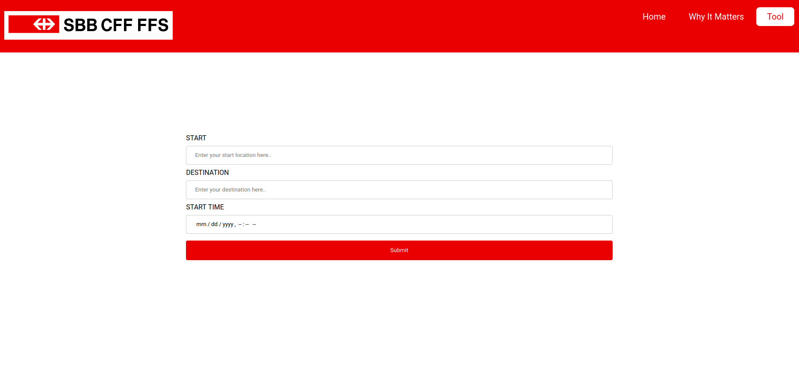

#  TEAM CAN-GURU: BETTER BIKE BOOKING FOR SBB

## STEPS

### 1) Data Preprocessing

* For each reservation, define sections (between train stations).
* For each section, define the latest bike spot reservation.
* The latest bike spot reservation for each section is the target variable.
* https://github.com/davhofer/start_hack/blob/master/block_splitter.py

### 2) Data Enrichment

* Features given from the reservation data are: train line, time, cities.
* Features such as weekday, holiday and weather are added.
* Bike hooks capacity is added based on the expected train formation (to complement reservation data from 2019-2020).
* https://github.com/davhofer/start_hack/blob/master/data_enrichment.ipynb

### 3) Model training

* Train a regression model (XGBoost). Use the enriched dataset to predict the latest time for a bike spot reservation.
* The model predicts the latest time to reserve a bike spot for each section along the travel route. 
* The most critical section (which needs reservation longest in advance) defines the overall prediction.
* https://github.com/davhofer/start_hack/tree/master/model.

### 4) Complement user input with real-time data
* Requests to SBB API to find the train connection for the requested journey.
* Request to meteomatics to predict weather on the journey date. 
* https://github.com/davhofer/start_hack/tree/master/api

### 5) User interface

* Web interface where user inputs journey details: start point, destination and travel date+time.
* User receives a prediction for the latest time when a bike spot on the desired connection is available.

